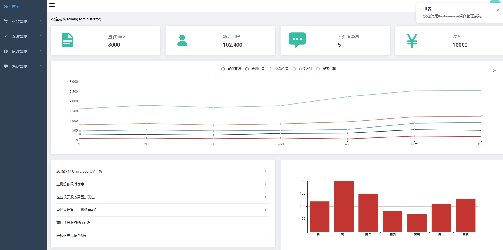
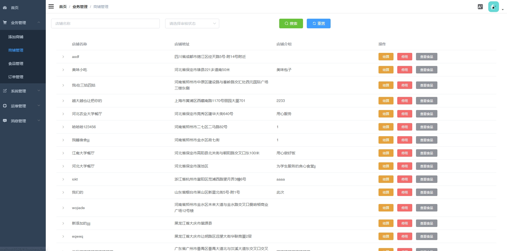
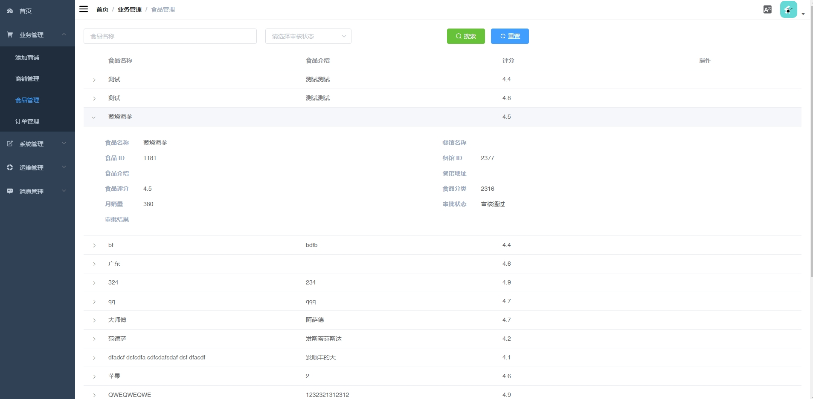
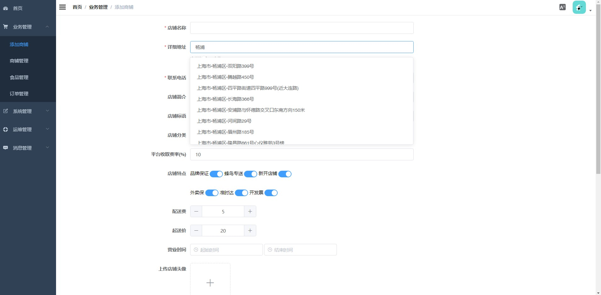
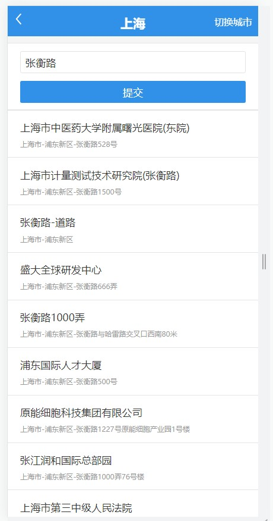
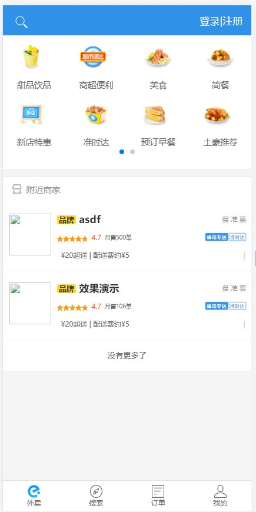
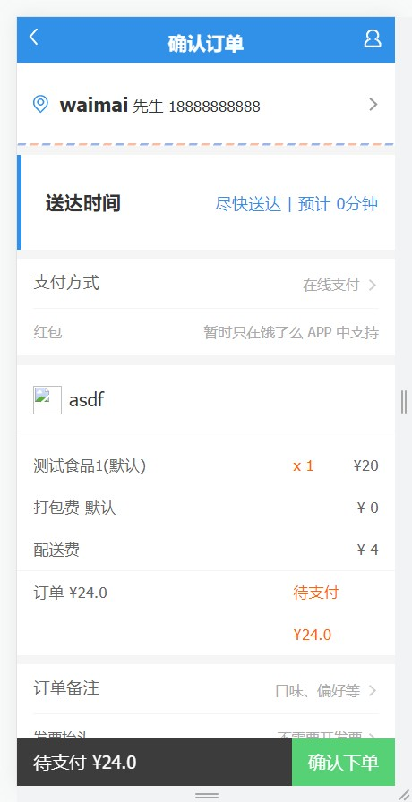

**郑重声明: 项目经过本地测试，确保可以运行， 可以用于学习和毕业设计参考~**

#### 1.项目介绍
基于spring boot和vue的前后端分离的外卖系统, 包含手机端，后台管理功能.

- 核心框架：Spring Boot
- 数据库层：Spring data jpa/Spring data mongodb
- 数据库连接池：Druid
- 缓存：Ehcache
- 前端：Vue.js
- 数据库：mysql5.5以上,Mongodb建议4.0(不要使用4.2及其已上版本，否则有部分api需要自行调整)
- waimai-mobile 手机端站点
- waimai-manage后台管理系统
- waimai-api java接口服务
- waimai-core 底层核心模块
- waimai-generate 代码生成模块

**很多小伙伴问我要sql源文件,请仔细看项目内的说明,启动api模块,自动注入sql呢**

#### 2.部署说明
##### 2.1 后端启动

- 创建数据库,并修改项目内的相关配置文件
- 启动redis,并修改项目内的相关配置文件
- 定位需要百度地图api的key,自行申请,并设置IP白名单
- 按照文档,创建mongoDB数据库,导入相关数据,配置相关目录
- 启动api模块,自动注入sql,后端项目启动成功~

##### 2.2 管理web
 
 - 进入manage模块的目录
 - npm install
 - npm run dev
 
##### 2.3 移动端web
 - 进入mobile模块的目录
 - npm install
 - npm run dev
 
#### 3. 项目部分截图

